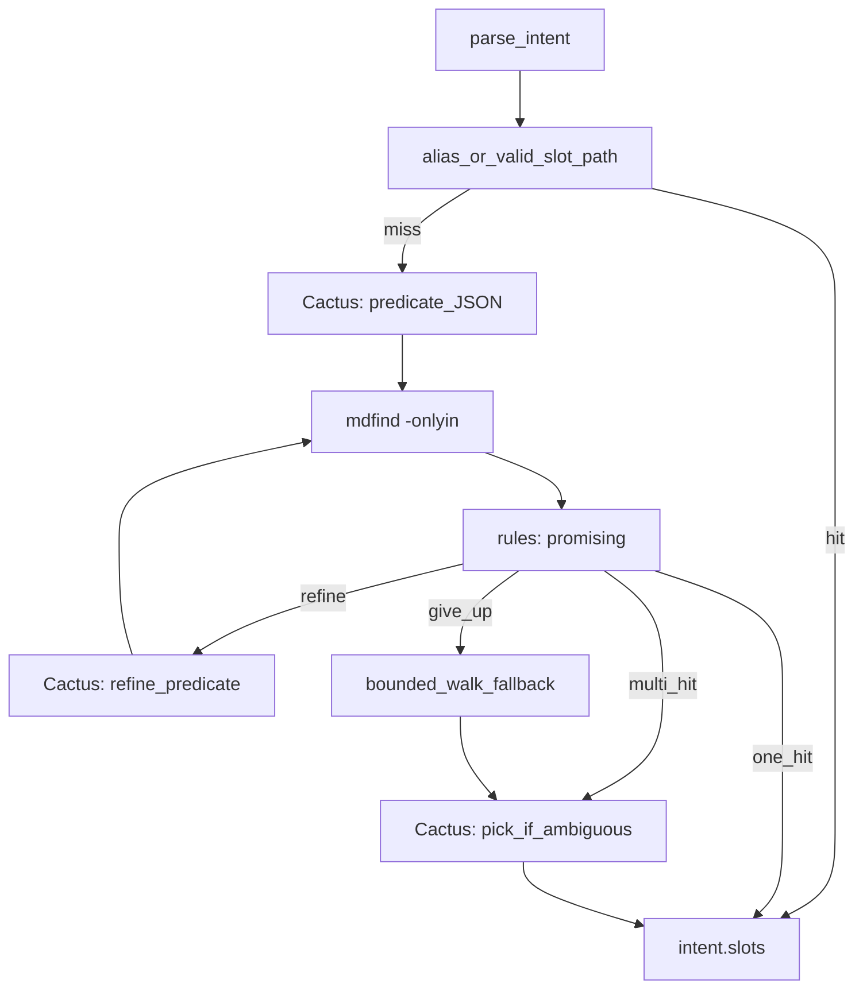

# Local disk resolution — Cactus-built Spotlight predicates + iteration

## Current behavior

- Paths come from [`config/resources.py`](config/resources.py) `FILE_ALIASES` and [`executors/local/filesystem.py`](executors/local/filesystem.py) `find_by_alias`.
- [`orchestrator/orchestrator.py`](orchestrator/orchestrator.py) uses `collected_data.get("resume_path")` first, then `find_by_alias("resume")`. **`resume_path` in `intent.slots` flows through** to `collected_data`.

## Goal of this iteration

- **No fixed “resume PDF” predicates only**: **Gemma 4 / Cactus** proposes **Metadata query predicates** (and optional scope) from natural language + structured intent so the agent can target **arbitrary** file-finding tasks (resumes, decks, contracts, images named in the transcript, etc.).
- **Closed loop**: If the first search is empty, too large, or **not promising**, Cactus **refines the predicate** (broader, narrower, different metadata, different `-onlyin` from the allowlist) and **retries**, up to a **small max iteration** count—mirroring “agentic” search without hardcoding per-task recipes.

## Phasing: prototype first, then tune

**Recommendation: ship a working end-to-end prototype, then iterate on latency and accuracy with measurements—not the other way around.**

- **Why prototype first**: Predicate quality, “promising” thresholds, and real `mdfind` behavior on messy disks are **empirical**. You learn faster from a thin vertical slice (resolver + wiring + debug script + a few logs) than from designing advanced optimizations before you know which step dominates (Cactus vs Spotlight vs walk) or where mistakes cluster (bad predicates vs bad picks vs indexing gaps).
- **What to bake in from day one (cheap, not premature optimization)**: Local-only policy, allowlisted `-onlyin`, predicate validation, rules-first gating, caps, and **light timing logs** (`[file-resolve] cactus_ms=… mdfind_ms=…`) so the second phase is data-driven.
- **Second phase**: Tighten prompts, adjust thresholds, merge Cactus calls, template predicates, caching, or different refine strategies—using traces from real transcripts and real machines.

## Iteration workflow (generic template)

Use the same rhythm for **any** component you want to improve with an agent: spec → thin slice → measurable logs → golden inputs → change one lever → lock tests.

**Template (copy for vision planner, STT, orchestrator, etc.)**

1. **Spec anchor**: One plan or ticket lists scope, non-goals, and exit criteria; update it when you learn something material.
2. **Vertical slice**: End-to-end path that runs on your machine (even if dumb), plus a single debug entrypoint (`scripts/debug_…`, unit test, or `main` flag)—before edge-case completeness.
3. **Stable log prefix + timings**: Choose a grep-friendly prefix (e.g. `[vision-planner]`, `[stt]`) and log `event`, `exit_reason` or outcome, and `timings_ms` for expensive steps so bottlenecks are visible without PII.
4. **Golden inputs**: A short, fixed list of inputs you replay after each change (transcripts, WAV paths, URLs—whatever the component consumes). Same inputs → compare logs and behavior.
5. **One variable per iteration**: When tuning, change one of prompts, thresholds, model choice, or data scope per cycle so regressions are attributable.
6. **Feedback packet for the agent**: What you paste in chat—redacted log lines + expected vs actual + which golden input—without dumping secrets; optional debug env only when needed.
7. **Lock with tests**: Add or extend tests when behavior is correct so refactors do not silently regress; optional branch/commit per iteration.

**How to “enable” this for another component**

- Add the log prefix and timing lines when you **start** that work (not after).
- Add a subsection to the relevant plan file, or promote this template once to a repo-wide doc (e.g. `.cursor/rules/iteration_workflow.md` or a short section in `AGENTS.md`) and link to it from feature plans.
- For a given feature, name the golden inputs file or list in the plan so runs are reproducible.

**Applied here (file resolution)**

- Prefix `[file-resolve]`; golden transcripts; grep `exit_reason` / `timings_ms`; `VOICE_AGENT_FILE_RESOLVE_DEBUG` for predicates; tests in `tests/test_file_resolve.py` when stable.

## Latency and local-only policy (fast + private)

- **No cloud for file resolution**: This stage must **not** call Gemini or any remote API. Use **Cactus CLI only** for text JSON steps (same as [`intent/parser.py`](intent/parser.py) Cactus path). If Cactus is unavailable, fall back to **aliases + rules + walk**, not Gemini.
- **Early exits (microseconds–milliseconds)**:
  - If `intent.slots` already contains a valid absolute `resume_path` (or equivalent) and the file exists, **skip** the whole resolver.
  - If `FILE_ALIASES` / `find_by_alias` resolves and the user intent clearly maps to a known alias, **use it** before any `mdfind` (configurable: `VOICE_AGENT_FILE_RESOLVER_ALIAS_FIRST=1` default on).
- **Minimize Cactus round-trips** (each `cactus run` is the dominant cost on CPU/ANE):
  - **Default `VOICE_AGENT_FILE_PREDICATE_MAX_ROUNDS` to 2** (not 3+) so typical flows do at most **initial predicate + one refine**.
  - **Rule-based “promising” gate** first: empty → refine; count above high-water → too broad → refine; count 1 → **done** (no picker); count 2–8 in “sweet spot” → **one** Cactus **pick** if needed; **no** separate Cactus “judge” call—rules decide refine vs pick vs give up (saves one full model pass per iteration).
  - **Tiny prompts**: fixed short MD cheat sheet; candidate lists as **basename + parent dir** only; truncate to `FILE_INDEX_MAX_CHARS`; **no** full paths repeated in refine prompts beyond what’s required.
  - **Combine operations where possible**: the **refine** prompt can also return the **final choice** if the model returns both `next_predicate` and `chosen_path` when the candidate set is already small—implementation detail to avoid back-to-back Cactus calls on the same round.
- **Spotlight is already fast**: `mdfind` hits the index; keep **per-query result caps** small (e.g. 30–50) so post-processing and prompts stay bounded.
- **Walk fallback is last and bounded**: depth/ignore caps; only run when `mdfind` fails or exhausts rounds—avoid doubling work when Spotlight already returned enough signal.

## Why Spotlight remains the execution engine

- **`mdfind`** evaluates predicates against the **Spotlight index** (metadata and often content). The **model does not** need a full directory listing first; it outputs **query strings** the runtime executes safely.

## Safety and control

- **Allowlisted search roots only**: Config lists directories (e.g. `~/Desktop`, `~/Documents`, `~/Downloads`). Each `mdfind` invocation uses **`-onlyin <resolved_path>`** so results cannot drift to arbitrary volumes unless explicitly configured.
- **No shell interpolation**: Run `subprocess` with `shell=False`, predicate as a **single argv** to `mdfind` (after validation).
- **Predicate validation**: Reject or strip dangerous patterns (newlines, backticks, `;`, subshell risk). Enforce **max length**. Optionally restrict to a **character class** compatible with MDQuery syntax, or use a **two-phase** approach: model picks from **enum buckets** (e.g. “PDF + name contains”, “image + last 7 days”) mapped to **templates**—trade-off between flexibility and safety. **Default in plan: validated free-form predicate** with strict length and charset checks; if too brittle in practice, narrow to template mapping in a follow-up.
- **Caps**: Max **N** iterations (default **2**), max **M** paths per query (e.g. 40–50), max chars for prompts.

## Proposed pipeline

### 1. Settings ([`config/settings.py`](config/settings.py))

- `VOICE_AGENT_FILE_SEARCH_ROOTS` — comma-separated; each used as `-onlyin` (resolved, must exist or skip).
- `VOICE_AGENT_FILE_PREDICATE_MAX_ROUNDS` — max Cactus refine loops (**default 2** for latency).
- `VOICE_AGENT_FILE_RESOLVER_ALIAS_FIRST` — try `FILE_ALIASES` before Spotlight when applicable (default on).
- `VOICE_AGENT_FILE_MDFIND_MAX_RESULTS` — per-query cap.
- `VOICE_AGENT_FILE_INDEX_MAX_CHARS` — cap for candidate lists in prompts.
- `VOICE_AGENT_FILE_RESOLVER` — master enable/disable.
- `VOICE_AGENT_USE_SPOTLIGHT` — allow disabling `mdfind` (walk-only).

### 2. `mdfind` runner ([`executors/local/file_index.py`](executors/local/file_index.py) or `spotlight.py`)

- `run_mdfind(predicate: str, only_in: Path, limit: int) -> list[Path]`
- Use `-0` and split on NUL for paths; truncate to `limit`.
- On non-zero exit or missing `mdfind` binary: return empty and signal failure for fallback.

### 3. Cactus predicate loop ([`intent/file_resolve.py`](intent/file_resolve.py))

**Round 1 — generate initial predicate**

- **Input**: `raw_transcript`, `IntentObject` (goal, slots, `uses_local_data`), short **cheat sheet** of common MD attributes (`kMDItemContentTypeTree`, `kMDItemDisplayName`, `kMDItemFSName`, `kMDItemFSCreationDate`, etc.) and logical operators allowed in Spotlight queries.
- **Output JSON** (strict): e.g. `{ "predicate": "...", "only_in_root_index": 0, "rationale": "..." }` where `only_in_root_index` picks from the **ordered allowlisted roots** (never a raw path from the model).

**Execute** `mdfind` for that root + validated predicate.

**Assess “promising” (rules only — no model)**

- Empty → refine (if rounds remain) or walk fallback.
- Count above `HIGH_WATER` (e.g. 40) → too broad → one **Cactus refine** only if rounds remain.
- Count 1 → **deterministic**: use that path (validate under root); **no Cactus pick**.
- Count in sweet spot (e.g. 2–15) → **one Cactus pick** prompt with **basenames + parent only**; if over token budget, **random/sample** down to 12 lines before calling Cactus.

**Refine rounds 2..K**

- If rules say `refine` and round `< max_rounds`: **one** Cactus call with **previous predicate**, **counts**, **short basename sample** → revised predicate JSON.
- Repeat until rules say stop, `give_up`, or max rounds.

**Final path selection**

- **0 Cactus** when exactly one candidate after rules; otherwise **one** Cactus JSON: `{ "chosen_path": "...", ... }` with path ∈ **allowed set** only.

**If still stuck**: run **bounded walk** under the same roots (depth/ignore caps), pass that list into the same **final picker** prompt, or second predicate attempt with simpler predicate.

**Aliases**: If everything fails, fall back to `FILE_ALIASES` / `find_by_alias` as today.

### 4. Wiring

- After `parse_intent` in [`main.py`](main.py) and [`scripts/debug_local_flow.py`](scripts/debug_local_flow.py): `await enrich_intent_with_resolved_files(intent, transcript)`.
- Populate e.g. `resume_path` for apply flows; generalize slot keys as needed for other `uses_local_data` entries.

### 5. Tests

- **Predicate validation**: reject unsafe strings.
- **Path validation**: chosen path ∈ allowed set and exists.
- **Mock**: fake `mdfind` stdout to test loop without macOS.
- **Walk fallback**: temp directory tree.

### 6. Logging and observability (for iteration after prototype)

Implement from the first prototype so tuning is evidence-based. Use a single prefix: **`[file-resolve]`** (or `logging.getLogger("yc_voice_agent.file_resolve")` with a handler that keeps the same visible prefix).

**Always log (structured key=value or JSON lines on one line per event)**

- **`event`**: `start` | `exit` | `round` | `mdfind` | `cactus` | `walk` | `fallback`
- **`exit_reason`**: `skipped_slot_path` | `alias_hit` | `alias_miss` | `disabled` | `no_cactus` | `single_hit` | `picked` | `refine` | `max_rounds` | `walk_only` | `validation_failed` | `error` (and short human `detail` only when needed)
- **`timings_ms`**: `cactus_total`, `mdfind_total`, `walk_total`, `resolver_wall` (per invocation)
- **`counts`**: `predicate_rounds_used`, `mdfind_calls`, `last_result_count`, `walk_file_count`
- **`outcome`**: `success` | `partial` | `failure` and which slot was set (e.g. `resume_path`) without logging full path unless debug

**Privacy defaults**

- Do **not** log full user **transcripts** or **full absolute paths** at INFO. Log **basename** and **root index** (e.g. `root_index=0`) for debugging.
- Log **predicate strings** and **full paths** only when **`VOICE_AGENT_FILE_RESOLVE_DEBUG=1`** (or similar) is set.

**Per-round `round` event (when iterating)**

- `round_index`, `predicate_chars` (length only at INFO), `only_in_root_index`, `mdfind_result_count`, `rule_decision` (`refine` | `pick` | `single` | `give_up`)

**Implementation note**

- Wrap each `cactus run` and `mdfind` / walk in `time.perf_counter()` deltas; emit one line after each phase so traces are easy to grep.

**Settings**

- `VOICE_AGENT_FILE_RESOLVE_DEBUG` — default off; enables predicate text and fuller paths in logs.

## Data flow (mermaid)

## Optional follow-ups

- **Template-only mode** for high-security deployments: map Cactus output to a fixed set of predicate templates (less universal, safer).
- **User confirmation** when confidence is low ([`ui/confirmation.py`](ui/confirmation.py)).
- **Aggregate metrics**: if you later add a small on-disk JSONL of `exit_reason` + timings (opt-in), use it to compare prompt/threshold changes across versions.
