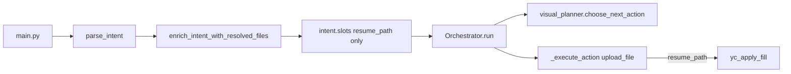

# Connect disk resolution to the orchestrator

## Current state

- [`intent/file_resolve.py`](intent/file_resolve.py) is **resume-centric**: it gates on `_needs_resume_path()` and always writes `intent.slots["resume_path"]` (even for `FIND_FILE`, which is semantically wrong).
- [`orchestrator/orchestrator.py`](orchestrator/orchestrator.py) never calls the resolver; it assumes upstream filled `resume_path` for `upload_file`.
- [`orchestrator/visual_planner.py`](orchestrator/visual_planner.py) passes `intent_slots` + `collected_data` in JSON to Cactus but has **no explicit "disk summary"** field—paths are easy to miss or conflate.

## Target shape

**Single source of truth for resolved paths:** a small map on the intent (or merged into `collected_data` at orchestrator start):

- `resolved_local_files: dict[str, str]` — **role → absolute path** (e.g. `"resume"`, `"attachment"`, `"deck"`, `"target"`).
- Legacy **`resume_path`** can remain as a **derived convenience**: if `"resume"` exists in the map, set `slots["resume_path"]` for older YC browser code paths, or migrate call sites to `resolved_local_files["resume"]`.

**Resolver behavior:**

- Replace `_needs_resume_path` / single output with **file roles to resolve**, derived from:
  - `intent.goal`,
  - `intent.uses_local_data` (extend usage of tags like `resume`, `attachment`, `document`, …),
  - optional parser slots such as `file_hints: list[{"role", "description"}]` (future-friendly).
- For each role, run the **same** pipeline (Spotlight + predicate rounds + pick + refine on low confidence) with a **role-specific transcript hint** (e.g. append `"Role: attachment — user asked: …"`).
- **FIND_FILE**: resolve the user’s query into one path and store under `resolved_local_files["found"]` (or `target`) instead of overloading `resume_path`.

## Where to hook resolution (orchestrator connection)

**Recommended:** call resolution **inside** [`Orchestrator.run`](orchestrator/orchestrator.py) **before** the first `choose_next_action`, e.g. `await resolve_local_paths_for_intent(intent, transcript)` which:

1. Mutates `intent.slots` / attaches `resolved_local_files`.
2. **`state.collected_data.update(...)`** so every planner step sees stable keys: `resolved_local_files`, plus backward-compatible `resume_path` if present.

**Optional:** keep [`main.py`](main.py) calling the same function for logging UX ("parsed → resolved → execute") or remove duplicate and rely only on orchestrator—pick one to avoid double resolution (guard with `if "resolved_local_files" not in intent.slots` or idempotent resolver).

## Visual planner: contextual disk access

- Extend [`_build_prompt`](orchestrator/visual_planner.py) with a **compact, non-huge** block, e.g. `disk_context`:
  - list of `{role, basename, parent_folder, age_hint}` — **not** full paths if you want safer logs; full paths stay in `collected_data` for execution only.
- Update the instructions so Cactus knows **`upload_file` must reference which role** (`params.file_role: "resume"`) and the orchestrator resolves to a real path.
- Extend [`ALLOWED_ACTION_TYPES`](orchestrator/visual_planner.py) / `_execute_action` minimally for general tasks:
  - **`reveal_in_finder`** (macOS `open -R path`) — safe, useful after FIND_FILE.
  - Later: **`attach_to_mail`** or pass `resolved_local_files` into existing Mail flows—only if you add AppleScript support.

## Executor wiring

- [`_execute_action`](orchestrator/orchestrator.py): change `upload_file` to resolve path as:
  - `params.get("file_role")` → `data["resolved_local_files"][role]`, else fall back to `resume_path` / `resolved_local_files["resume"]`.
- Add small helper `_path_for_file_action(collected_data, params) -> str`.
- [`_run_local`](orchestrator/orchestrator.py) `find_file`: prefer `resolved_local_files` over raw `find_by_alias` when alias map is empty.
- [`executors/local/filesystem.py`](executors/local/filesystem.py) (or `applescript.py`): add `reveal_in_finder(path: str)` using `subprocess` / `open -R`.

## Parser and schema (light touch)

- [`intent/schema.py`](intent/schema.py): document `slots` keys for `resolved_local_files` (no strict TypedDict required initially).
- [`intent/parser.py`](intent/parser.py) / rules: optionally emit **file role hints** in `slots` when user says "attach my deck" (e.g. `uses_local_data` includes `document` and `slots["file_query"]` text)—feeds resolver prompts without new goals.

## Tests

- Unit: resolver writes multiple keys when mocked; orchestrator `upload_file` picks path by `file_role`.
- Contract: `test_core_contracts` / smoke: intent with `resolved_local_files` only—no crash.

## Phasing

| Phase | Scope |
|-------|--------|
| **A** | Data model `resolved_local_files`, refactor `file_resolve` to multi-role, FIND_FILE uses `found` key, orchestrator calls resolver once + merges into `collected_data`, `upload_file` uses `file_role`. |
| **B** | Visual planner `disk_context` block + prompt text + optional `reveal_in_finder` action + executor. |
| **C** | Parser hints + Mail/Calendar attachments (if desired). |

## Risks / constraints

- **Token size:** keep planner `disk_context` summarized (basenames + age), not full directory dumps.
- **Double work:** ensure resolver runs once per command (orchestrator-only vs main-only).
- **Privacy:** logs should prefer basename over full path unless `FILE_RESOLVE_DEBUG`.
